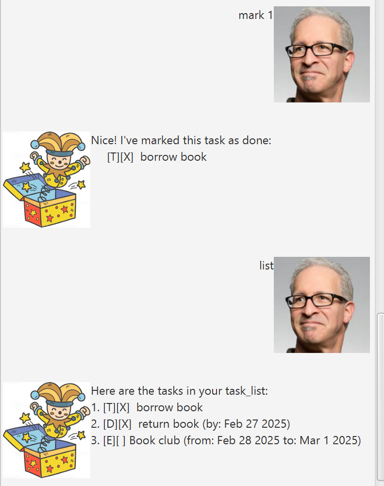

# Jackbit User Guide



_Jackbit: Your friendly task management assistant!_

Jackbit is a **text-based task manager** designed to help you organize your tasks effortlessly. Whether it's a simple to-do,a deadline, or an event, Jackbit has got your back.  
It's fast, easy to use, and comes with a fun, clown-themed personality! 🤡
---
## Adding Tasks
Jackbit supports three types of tasks: **Todo**, **Deadline**, and **Event**. You can add tasks using simple commands.

### _Adding a Todo_
A _**Todo**_ is a simple task with a description.

**Command:**
`todo <description>`

**Example:**
`todo Buy groceries`


**Expected Output:**
```
I've added this task:
[T][ ] Buy groceries
The number of tasks you have is 1
```  
---
### _Adding a Deadline_  
A _**Deadline**_ is a task with a description and a due date.

**Command:**
`deadline <description> /by <date>`

**Example:**
`deadline Submit report /by 2023-10-31`

**Expected Output:**
```
I've added this task:
[D][ ] Submit report (by: Oct 31 2023)
The number of tasks you have is 2
```
---
### _Adding an Event_
An _**Event**_ is a task with a description, a start date, and an end date.
 

**Command:**
`event <description> /from <start date> /to <end date>`

**Example:**
`event Team meeting /from 2023-11-01 /to 2023-11-02`

**Expected Output:**
```
I've added this task:
[E][ ] Team meeting (from: Nov 1 2023 to: Nov 2 2023)
The number of tasks you have is 3
```
---
## Listing Tasks
You can **_view all your tasks_** in one place with the `list` command.

**Command:**
`list`

Expected Output:
```
Here are the tasks in your task_list:
1. [T][ ] Buy groceries
2. [D][ ] Submit report (by: Oct 31 2023)
3. [E][ ] Team meeting (from: Nov 1 2023 to: Nov 2 2023)
```
---
## Marking and Unmarking Tasks  
You can **_mark_** tasks as done or **_unmark_** them if they're not completed yet.

### _Marking a Task_
**Command:**
`mark <task number>`

**Example:**
`mark 1`

**Expected Output:**

```
Nice! I've marked this task as done:
[T][X] Buy groceries
```
---
### _Unmarking a Task_
**Command:**
`unmark <task number>`

**Example:**
`unmark 1`

**Expected Output:**
```
OK, I've marked this task as not done yet:
[T][ ] Buy groceries
```
---
## Deleting Tasks
You can **_remove tasks_** you no longer need.

**Command:**
`delete <task number>`

**Example:**
`delete 1`

**Expected Output:**
```
I have removed this task from your task_list:
[T][ ] Buy groceries
The number of tasks you have is 2
```
---
## Finding Tasks
You can **_search_** for tasks by keyword.

**Command:**
`find <keyword>`

**Example:**
`find report`

**Expected Output:**

```
Here are the matching tasks in your list:
1. [D][ ] Submit report (by: Oct 31 2023)
```
---
## Exiting Jackbit
When you're done, you can **_exit_** Jackbit by typing bye, or by closing the window.

**Command:**
`bye`

**Expected Output:**
```
See you later!!
```
---
## Persistent Storage
Jackbit automatically **_saves your tasks_** to a file (data/jackbit.txt).  
When you restart Jackbit, your tasks will be reloaded, so you **<ins>never lose track of what you need to do</ins>.**
---
## Upcoming Features
- [ ] 🚀 **_Reminders:_** Get notified about upcoming deadlines and events.
- [ ] 🚀 **_Priority Levels:_** Assign priorities to your tasks for better organization.
- [x] 🚀 Search Functionality: Quickly find tasks by keyword.